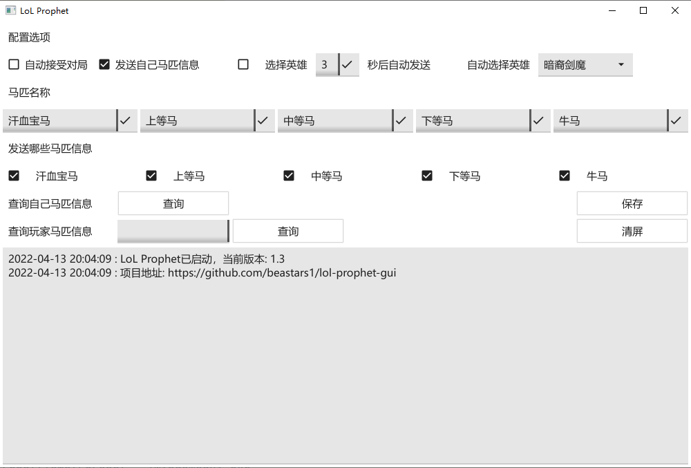

# lol-prophet-gui

> 基于 hh-lol-prophet: [https://github.com/real-web-world/hh-lol-prophet](https://github.com/real-web-world/hh-lol-prophet)

- lol 看看谁是牛马，分析己方玩家近期数据，发送/复制对应的🐎、kda、得分

### 得分规则

- 默认100分

| 得分  |  代号  |
|:---:|:----:|
| 150 | 汗血宝马 |
| 125 | 上等马  |
| 105 | 中等马  |
| 95  | 下等马  |
| <95 |  牛马  |

- 计分方式：[计分规则](./计分方式.md)

### 截图

